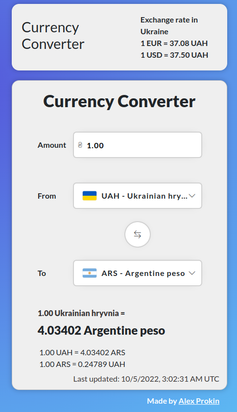
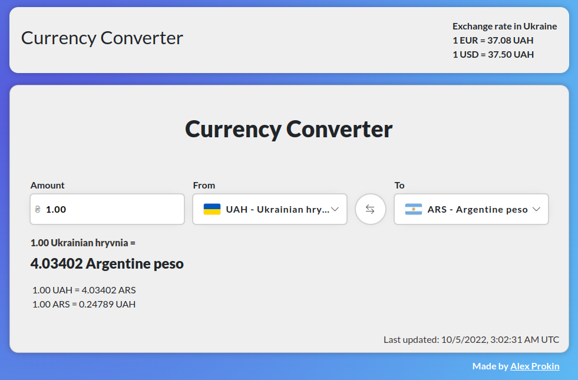

<h1 align="center"> AngularCurrencyConverter  </h1>

## About

💱 A simple currency converter created using Angular 14 💵.
The project gets the currency rate from [ExchangeRate-API](https://www.exchangerate-api.com/docs/free).

## Screenshots

## Features

- Allows you to quickly convert currencies in real time
- Saves the selected currencies with the entered amount and enters the value in localStorage
- Adapts to the size of the browser window

## Resources

- [ExchangeRate-API](https://www.exchangerate-api.com/docs/free). Currency rate source. [`https://open.er-api.com/v6/latest/UAH`](https://open.er-api.com/v6/latest/UAH)
- [REST Countries](https://restcountries.com/). Source of information about currencies (full name, symbol). [`https://restcountries.com/v3.1/all?fields=currencies`](https://restcountries.com/v3.1/all?fields=currencies)
- [currency-flags](https://www.npmjs.com/package/currency-flags). Flag image source.
